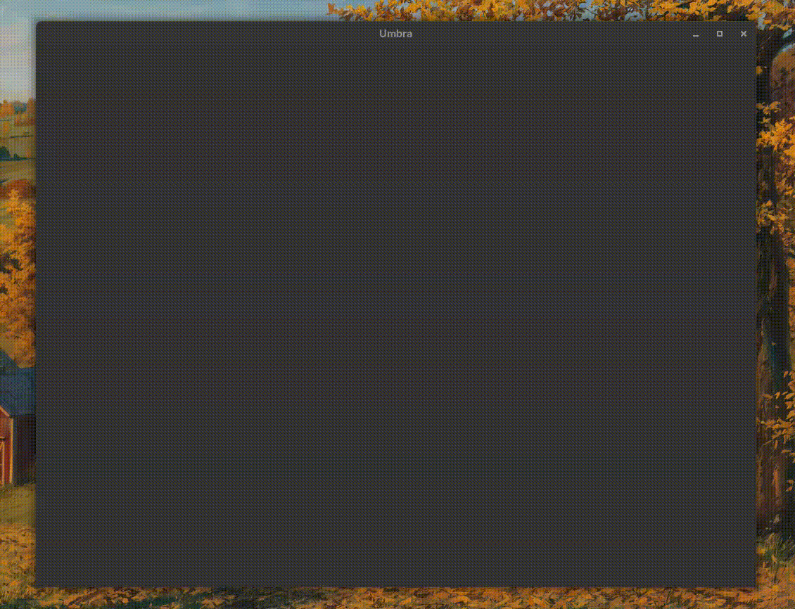
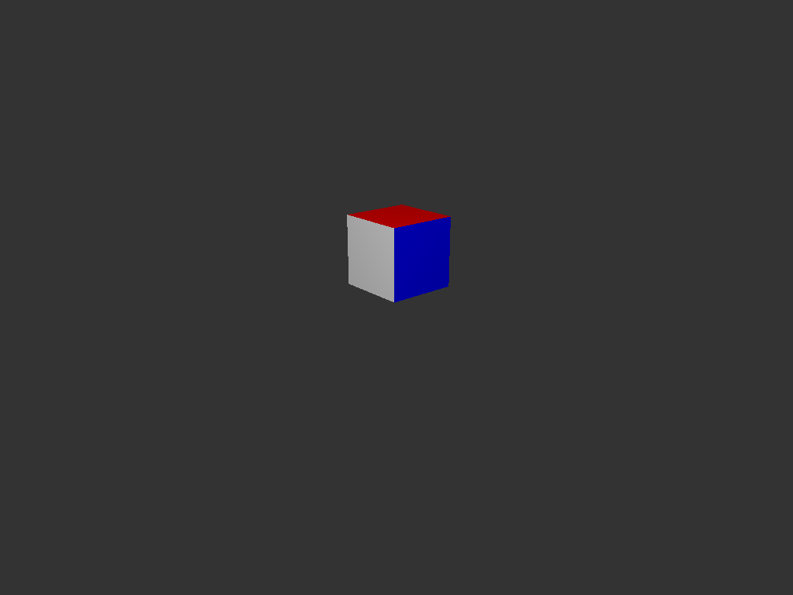
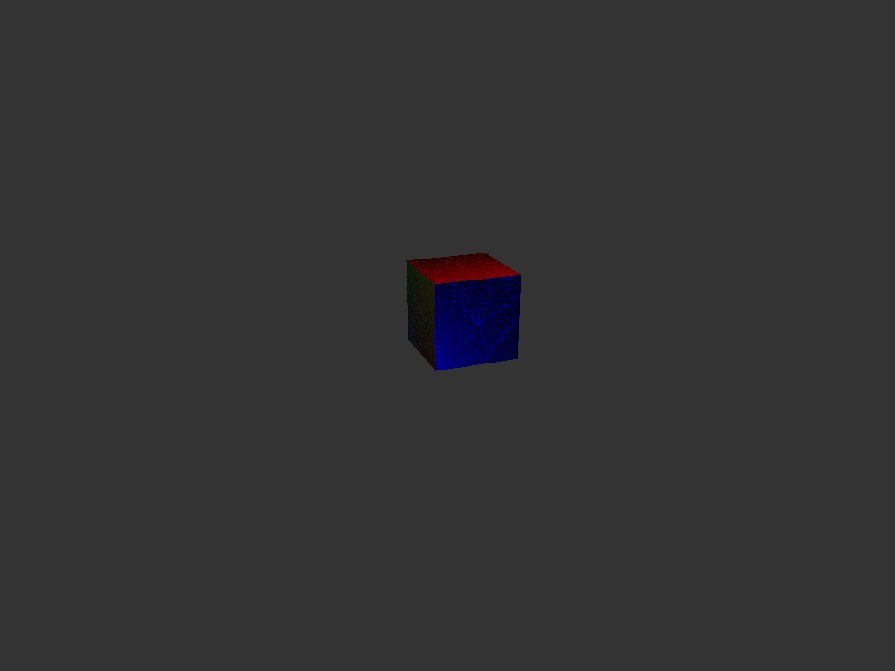

# Umbra Engine

#### A toy engine/renderer ont it's early stages made in modern C++ and OpenGL 4.6 core;

 - - -

>[!WARNING]
>I develop this project in my free time, updates aren't very frequent.

### Dependencies:

- C++ 26 compiler;
- Ninja;
- Glad -INCLUDED;
- GLFW -SUBMODULE;
- Premake -SUBMODULE;
- GLM -SUBMODULE;
- STB Image -INCLUDED.

 - - -

### Credits:
[Debug Texture](https://github.com/BlueG/DebugTextures)

 - - -

It's juts a simple side-project;

to clone:
``` shell
git clone --recursive https://github.com/MunFaill/Umbra.git
```

to build (Only on unix-like systems), go to the root folder and execute:

``` shell
./unix.sh
```

You can execute it from root folder, like this: 
```
./build/bin/Debug/Runtime
```
or, you cant just execute the binary manually.

 - - -

### Media:


